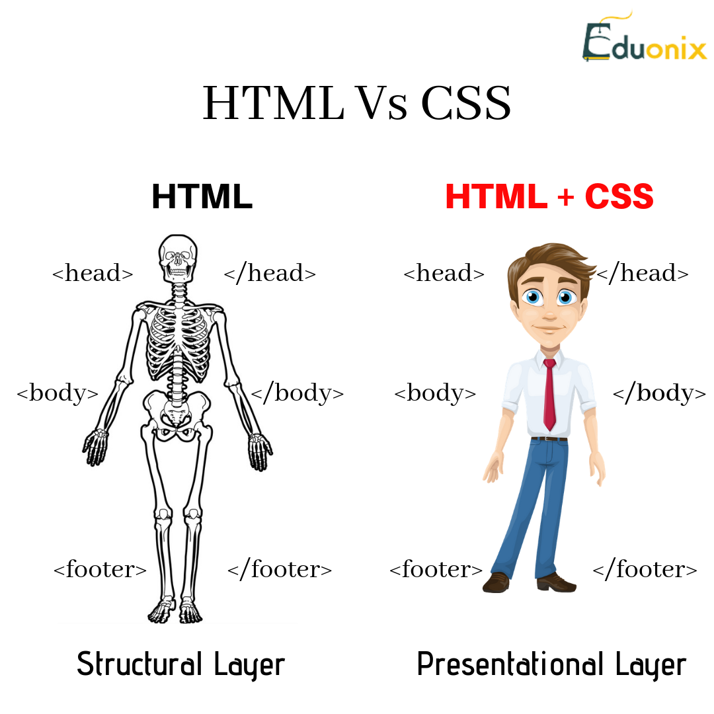

# Design web pages with CSS

## What is CSS?
#### `CSS` (Cascading Style Sheets) allows you to create great-looking web pages.


## What is CSS for?
#### CSS is a language for specifying how documents are presented to users — how they are styled, laid out, etc.



## CSS syntax

#### CSS is a rule-based language — you define rules specifying groups of styles that should be applied to particular elements or groups of elements on your web page. For example "I want the main heading on my page to be shown as large red text."
#### The following code shows a very simple CSS rule that would achieve the styling described above:

```
h1 {
    color: red;
    font-size: 5em;
}
```
#### The rule opens with a `selector` . This selects the HTML element that we are going to style. In this case we are styling level one headings `(<h1>)`.

#### We then have a set of curly braces `{ }`. Inside those will be one or more declarations, which take the form of property and value pairs. Each pair specifies a property of the element(s) we are selecting, then a value that we'd like to give the property.

#### Before the colon, we have the property, and after the colon, the value. CSS properties have different allowable values, depending on which property is being specified. In our example, we have the `color` property, which can take various color values. We also have the `font-size` property. This property can take various size units as a value.

#### A CSS stylesheet will contain many such rules, written one after the other.

``` 
h1 {
    color: red;
    font-size: 5em;
}

p {
    color: black;
}
```

## How To Add CSS
### Three Ways to Insert CSS
- #### External CSS.
- #### Internal CSS.
- #### Inline CSS.


### CSS Tools: Reset CSS
#### The goal of a reset stylesheet is to reduce browser inconsistencies in things like default line heights, margins and font sizes of headings, and so on.

#### The reset styles given here are intentionally very generic. There isn't any default color or background set for the body element, for example. I don't particularly recommend that you just use this in its unaltered state in your own projects. It should be tweaked, edited, extended, and otherwise tuned to match your specific reset baseline. Fill in your preferred colors for the page, links, and so on.