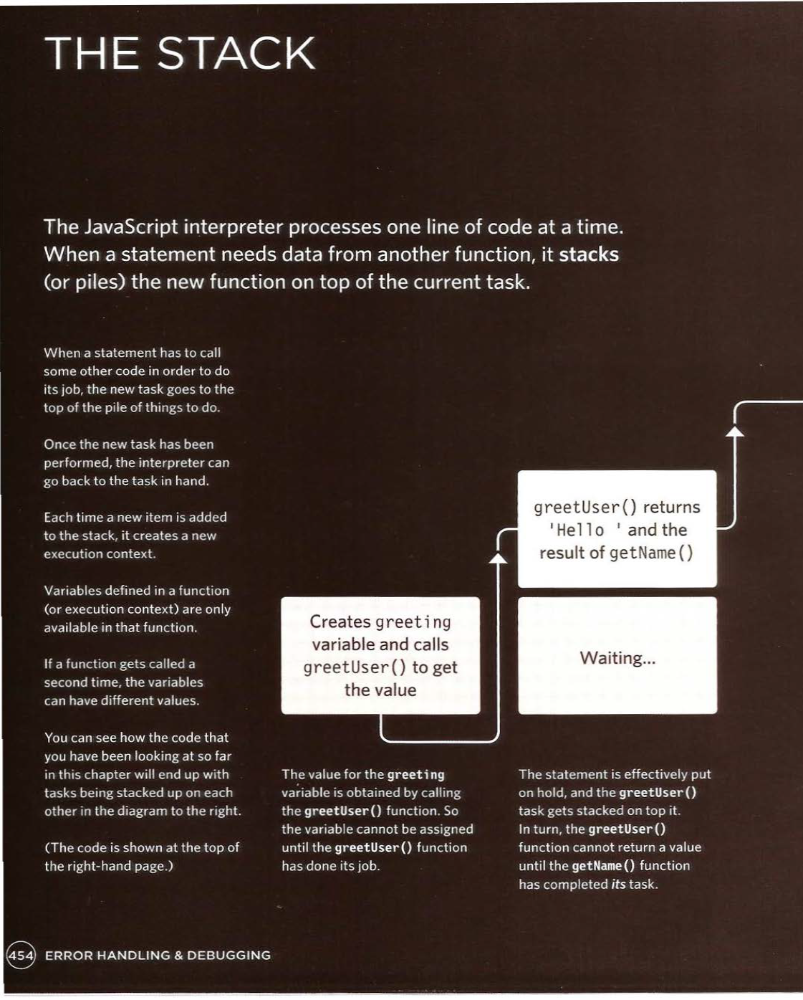

# HTML & CSS & JAVASCRIPT
## Design and Build Websites 

### ***Error Handling & Debugging**

#### ORDER OF EXECUTION:
##### To find the source of an error, it helps to know how scripts are processed.The order in which statements are executed can be complex; some taskscannot complete until another statement or function has been run.

#### EXECUTION CONTEXT & HOISTING

##### Each time a script enters a new execution context, there are two phases of activity:
##### 1- PREPARE: 
• The new scope is created
• Variables, functions, and arguments are created
• The value of the this keyword is determined

##### 2- EXECUTE
• Now it can assign values to variables
• Reference functions and run their code
• Execute statements

##### Understanding that these two phases happen helps with understanding a concept called hoisting. You may have seen that you can:

• Call functions before they have been declared

• Assign a value to a variable that has not yet been declared

#### LOGGING DATA TO THE CONSOLE

##### To differentiate between the types of messages you write  to the console, you can use three different methods. They use various colors and icons to distinguish them. 

1. `console. info()` can be used for general information
2. `console.warn()` can be used for warnings
3. `console.error()` can be used to hold errors

#### GROUPING MESSAGES 
##### 1. If you want to write a set of related data to the console, you can use the `console.group ()` method to group the messages together. You can then expand and contract the results.

##### It has one parameter; the name that you want to use for the group of messages. You can then expand and collapse the contents by cl icking next to the group's name.

##### 2. When you have finished writing out the results for the group, to indicate the end of the group the `console.groupEnd ()` method is used. 

